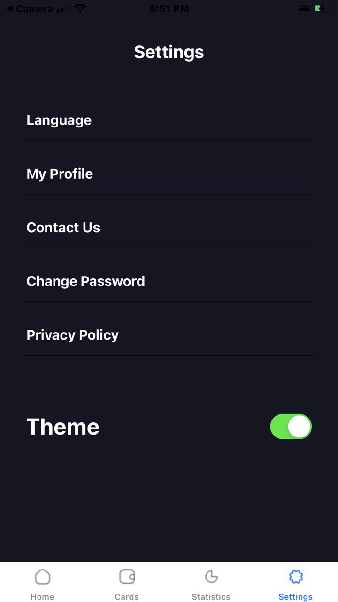

# BOTTOM TAB NAVIGATOR WITH THEME SWITCH FUNCTIONALITY

## 11065950, OJI NANA AKPAABE-ADESSA

This project demonstrates the implementation of a React Native application with bottom tab navigation, a light/dark theme switcher, and custom components to closely match a provided UI design. The application contains two main screens: HomeScreen and SettingsScreen, with CardScreen and StatisticsScreen on addition.

## Installation
Prerequisites
Before setting up the project, ensure you have the following installed on your development machine:

Node.js
npm (Node Package Manager)
React Native CLI
Expo Go App

## Features
## Bottom Tab Navigation
The application utilizes React Navigation to implement bottom tab navigation, allowing users to switch seamlessly between the Home and Settings screens. This provides a user-friendly interface for navigating different parts of the application.

## Light/Dark Theme Switcher
A key feature of this application is the ability for users to switch between light and dark themes. This enhances the user experience by providing a customizable interface that adapts to different lighting conditions and personal preferences.

Custom Components
Transaction List component was used to create a reusuable functionality for creating multiple transaction cards.

# Screenshots

